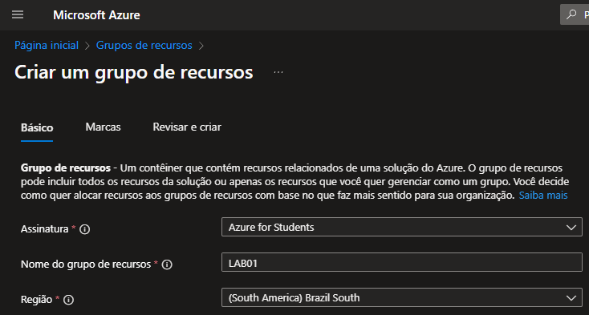
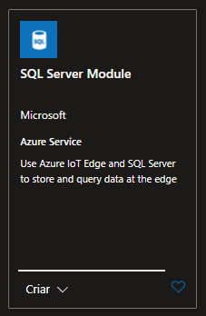
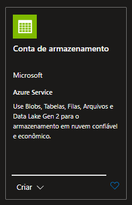
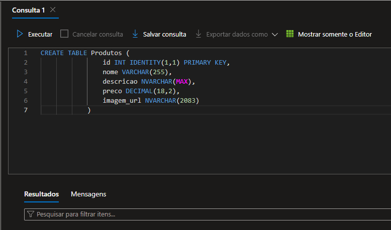
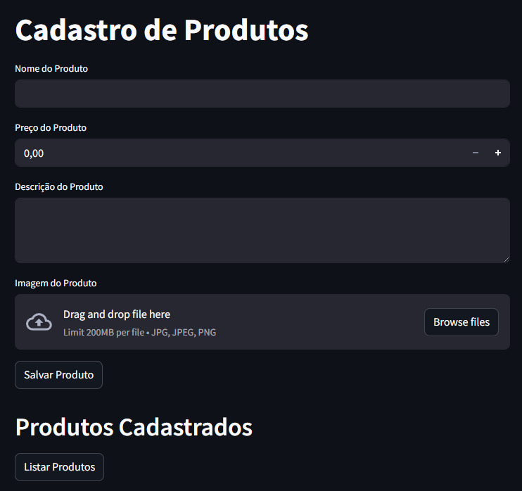

# Microsoft Application Platform com Python e Streamlit 🚀

Este projeto demonstra como integrar diversos serviços da plataforma Microsoft Azure em uma aplicação Python com interface em Streamlit. O foco está na criação de um sistema simples que salva e exibe imagens de produtos, armazenadas no Azure Blob Storage, com dados gerenciados em um banco de dados SQL Server hospedado no Azure.

## 📌 Etapas do Projeto

### 1. Criação do Resource Group



Criamos um **Resource Group** no Azure para agrupar todos os serviços utilizados no projeto, facilitando a organização e o gerenciamento dos recursos.

---

### 2. Criação do SQL Server e Banco de Dados SQL



Configuramos um **SQL Server** e um **banco de dados SQL** no Azure. Estes serão usados para armazenar as informações dos produtos, como nome e caminho da imagem.

---

### 3. Criação da Storage Account



Criamos uma **Storage Account** no Azure para armazenar as imagens dos produtos. Utilizamos o serviço de **Blob Storage** para upload e acesso aos arquivos.

---

### 4. Estrutura do Banco de Dados



Dentro do banco de dados, foi criada uma **tabela de produtos**, contendo os seguintes campos:
- `id` (int)
- `nome` (varchar)
- `descricao` (varchar)
- `preco` (decimal)
- `url_imagem` (varchar)

---

### 5. Implementação do Salvamento de Imagens



A aplicação permite ao usuário:
- Cadastrar um novo produto via interface Streamlit
- Fazer upload de uma imagem
- Salvar a imagem no Blob Storage
- Gravar os dados do produto e o caminho da imagem no SQL Server

## 🛠️ Ferramentas e Tecnologias Utilizadas

- **Python**
- **Streamlit** – Interface interativa da aplicação
- **azure-storage-blob** – Interação com o Blob Storage
- **pymssql** – Conexão com SQL Server
- **dotenv** – Gerenciamento de variáveis sensíveis
- **Microsoft Azure** – Plataforma de nuvem onde os serviços foram configurados

## 📁 Estrutura do Projeto

```bash
├── main.py            # Código principal da aplicação Streamlit
├── .env               # Variáveis de ambiente (conexões, secrets etc.)
├── requirements.txt   # Dependências do projeto
└── prints/            # Capturas de tela do processo
